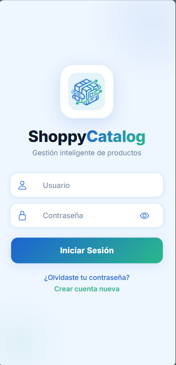
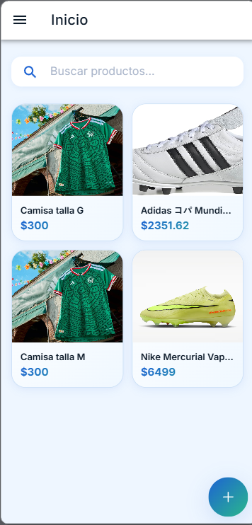
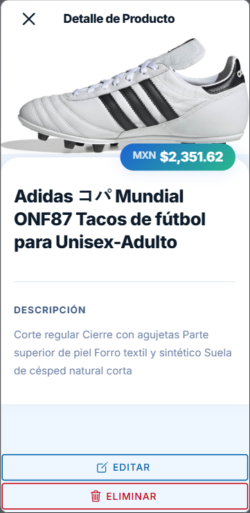

# 🛍️ ShoppyCatalog

> Catálogo de productos móvil construido con **Ionic Angular** y una **REST API en PHP**, aplicando Clean Architecture y principios SOLID.

---

## 📱 Screenshots

> Capturas de la app corriendo en dispositivo/emulador Android.

<div align="center">

| Pantalla de inicio | Catálogo de productos | Detalle de producto |
|---|---|---|
|  |  |  |

</div>

> **¿Cómo agregar tus imágenes?**
> 1. Crea una carpeta llamada `screenshots/` en la raíz del proyecto.
> 2. Guarda tus capturas con los nombres: `home.png`, `catalog.png`, `detail.png`.
> 3. Borra este bloque de instrucciones y sube los cambios con `git push`.

---

## 📌 Estado del proyecto

> ⚠️ **Proyecto en desarrollo activo.**
> El catálogo de productos está implementado. Autenticación y gestión de pedidos están planificados para próximas iteraciones.

---

## 🧩 Funcionalidades actuales

- 📦 Listado de productos con datos dinámicos desde la API
- 🔌 Integración REST API entre el cliente móvil y el backend PHP
- 🔐 Protección de endpoints con tokens
- 🔒 Cifrado de datos sensibles con OpenSSL

## 🗺️ Roadmap

- [ ] Autenticación de usuarios (login / registro)
- [ ] Carrito de compras
- [ ] Gestión de pedidos
- [ ] Panel de administración

---

## 🏗️ Arquitectura

```
ShoppyCatalog/
├── backend/                  # REST API en PHP
│   ├── controllers/          # Manejo de requests
│   ├── models/               # Lógica de negocio
│   ├── repositories/         # Acceso a base de datos
│   └── config/               # Configuración y conexión
│
└── mobile-app/
    └── ShoppyCatalog/        # App Ionic Angular
        └── src/
            └── app/
                ├── pages/    # Pantallas de la app
                ├── services/ # Comunicación con la API
                └── models/   # Interfaces TypeScript
```

**Principios aplicados:**
- ✅ Clean Architecture
- ✅ Principios SOLID
- ✅ Diseño RESTful

---

## 🛠️ Tech Stack

| Capa | Tecnología |
|---|---|
| Frontend móvil | Ionic 7 + Angular + TypeScript |
| Estilos | SCSS |
| Backend | PHP 8 |
| Base de datos | MySQL |
| Seguridad | OpenSSL · Autenticación por token |
| API | REST |

---

## 🚀 Cómo correr el proyecto

### Requisitos previos

- PHP 8.x
- MySQL 5.7+
- Node.js 18+
- Ionic CLI: `npm install -g @ionic/cli`

### Backend

```bash
git clone https://github.com/dhontavo/Catalogo_Tienda.git
cd Catalogo_Tienda/backend

cp config/config.example.php config/config.php
# Edita config.php con tus credenciales de BD

mysql -u root -p tu_base_de_datos < database/schema.sql

php -S localhost:8000
```

### App móvil

```bash
cd mobile-app/ShoppyCatalog

npm install

# Actualiza la URL del API en:
# src/environments/environment.ts → apiUrl: 'http://localhost:8000/api'

ionic serve                      # correr en navegador
ionic capacitor run android      # correr en Android
```

---

## 🔐 Seguridad

- Endpoints protegidos con **autenticación por token**
- Datos sensibles cifrados con **OpenSSL**

---

## 👤 Autor

**dhontavo** — [GitHub](https://github.com/dhontavo)

---

## 📄 Licencia

MIT License
